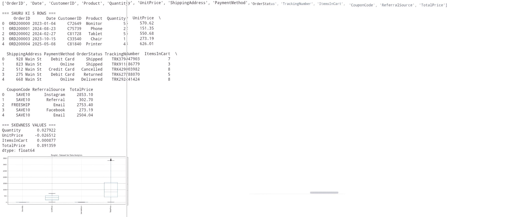

# Decodelabs Internship - Data Analysis Task

## Skewness Analysis
Performed skewness analysis on numerical columns using Python Pandas to check data distribution.

### Results:
| Column | Skewness Value | Interpretation |
| --- | --- | --- |
| TotalPrice | 0.89 | Positively skewed with outliers |
| Quantity | 0.027 | Approximately symmetric |
| UnitPrice | -0.026 | Approximately symmetric |
| ItemsInCart | 0.0008 | Approximately symmetric |

### Output Screenshot:

### Key Insight:
TotalPrice shows right-skewed distribution due to few high-value transactions, confirmed by outliers in boxplot.

---

## E-commerce SQL Analysis

### Overview
Analyzed dummy e-commerce Orders data using SQLite to find business insights for Decodelabs Internship Task 2.

### Key Results
- **Total Revenue**: ₹1,59,600
- **Best Payment Method**: UPI - ₹1,00,000 revenue from 2 orders  
- **Revenue Loss**: ₹55,000 due to 1 cancelled Tablet order i.e. 34% impact
- **Coupons**: 3 unique codes, each used once

### SQL Concepts Used
`CREATE TABLE`, `INSERT`, `GROUP BY`, `SUM()`, `COUNT()`, `WHERE`

### Files
- `sql-ecommerce-analysis.sql` - Complete table creation + 4 analysis queries
